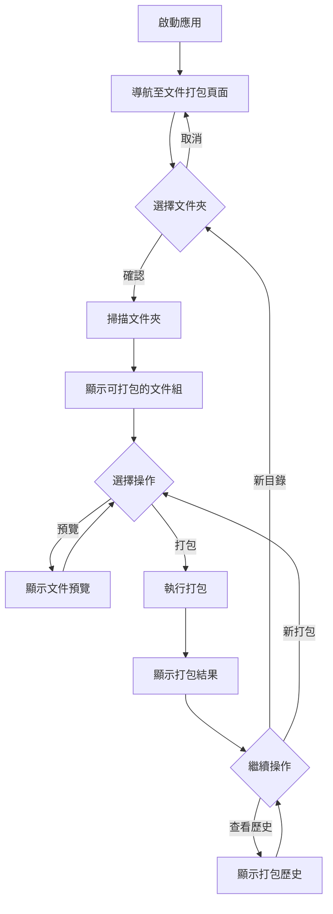
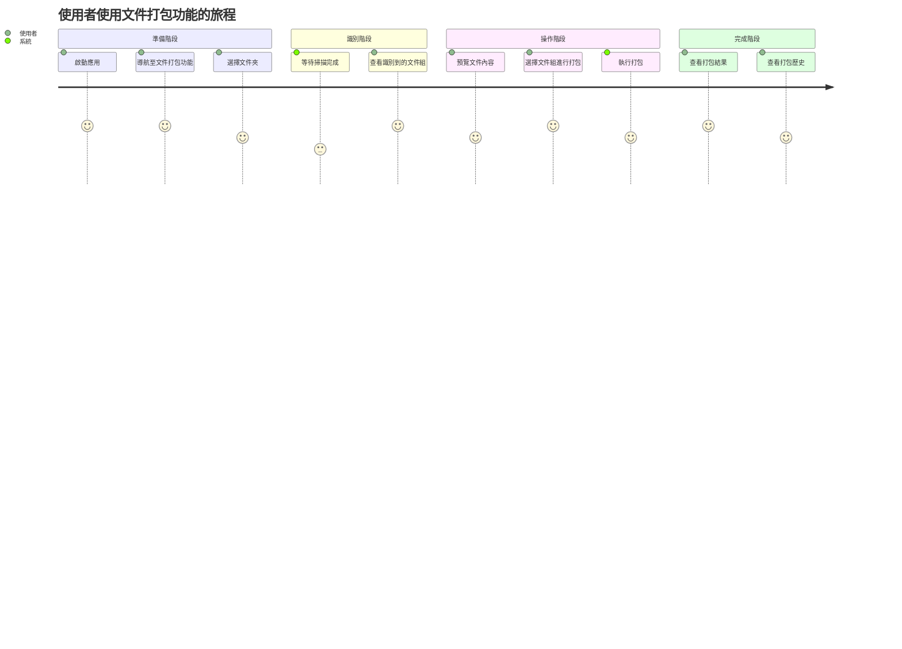
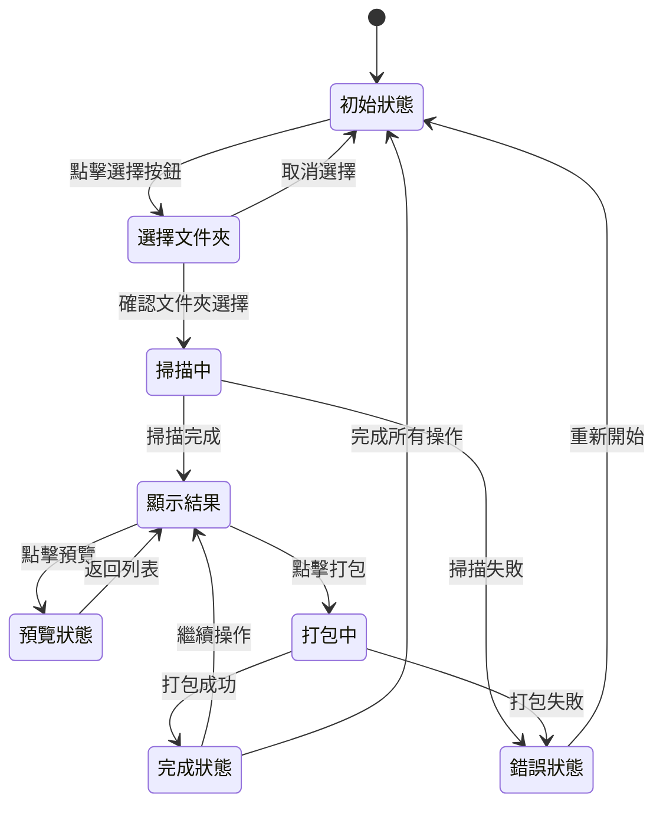
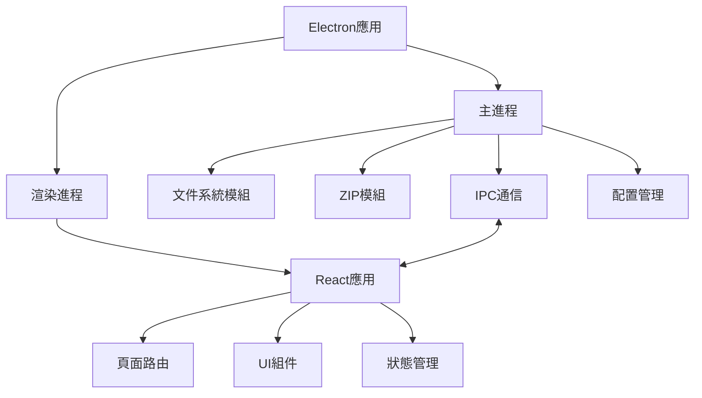
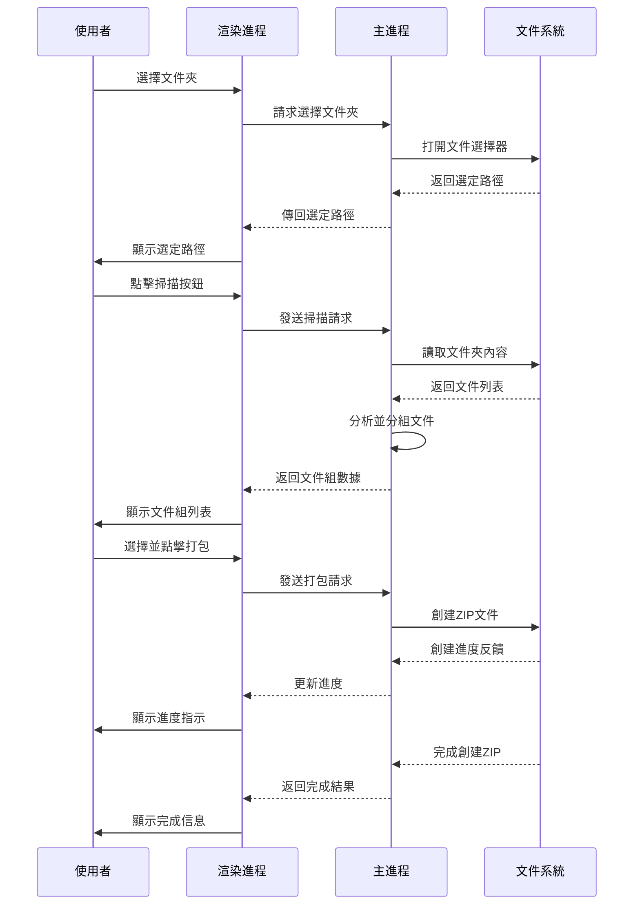

# 文件打包系統產品需求文檔

## 1. 專案概述

### 1.1 背景與目標
使用者在日常工作中，經常需要處理同名但不同擴展名的檔案，例如設計稿的不同格式版本、多媒體素材的不同格式等。手動整理這些檔案既費時又容易出錯。本專案旨在開發一個桌面應用程式，幫助使用者自動識別並打包同名不同擴展名的檔案，提高工作效率。

### 1.2 使用者群體
- 設計師（處理多種格式的設計檔案）
- 開發人員（管理程式碼和相關資源檔案）
- 媒體工作者（處理多格式的媒體素材）
- 一般辦公人員（管理文件檔案）

## 2. 功能需求

### 2.1 核心功能
1. **檔案夾選擇**：使用者可以選擇本地檔案夾作為掃描和打包的來源目錄
2. **檔案識別與分組**：自動掃描檔案夾，識別並分組同名但不同擴展名的檔案
3. **檔案打包**：將識別到的檔案組打包成ZIP壓縮檔
4. **打包記錄**：顯示已打包的ZIP檔案清單及其包含的原始檔案
5. **批次處理**：支援批次選擇和打包多組檔案

### 2.2 次要功能
1. **預覽功能**：在打包前預覽將被包含的檔案
2. **自訂設定**：允許使用者自訂打包選項（如壓縮等級、排除特定檔案類型等）
3. **打包歷史**：記錄和查看過去的打包操作
4. **搜尋過濾**：依據檔案名稱或副檔名過濾顯示結果

## 3. 使用者體驗流程

### 3.1 基本流程



### 3.2 使用者情境圖



### 3.3 操作狀態流程



## 4. 界面設計

### 4.1 整體佈局

應用將採用簡潔、現代的設計風格，主要界面元素包括：

- **側邊導覽欄**：提供應用功能的導覽選項
- **頂部標題欄**：顯示應用標題與窗口控制按鈕
- **主內容區**：顯示當前功能的主要界面
- **狀態欄**：顯示當前操作的狀態和提示信息

### 4.2 文件打包頁面設計

文件打包頁面將分為以下幾個區域：

1. **文件夾選擇區**
   - 文件夾路徑輸入框
   - 瀏覽按鈕
   - 掃描按鈕

2. **文件組列表區**
   - 表格顯示識別到的文件組
   - 每組顯示：基本名稱、文件數量、文件類型標識
   - 操作按鈕：預覽、打包
   - 批量選擇功能

3. **文件預覽區**
   - 顯示選中文件組包含的所有文件
   - 文件圖標、名稱、大小、類型等信息

4. **打包設置區**
   - 輸出路徑設置
   - 壓縮等級設置
   - 其他自定義選項

5. **操作結果區**
   - 操作狀態和進度顯示
   - 成功/失敗提示
   - 打包後的文件路徑和操作按鈕

### 4.3 打包歷史頁面設計

打包歷史頁面將包含：

1. **歷史記錄表格**
   - 日期時間
   - 壓縮包名稱
   - 源文件夾
   - 包含文件數量
   - 操作按鈕（打開位置、查看詳情）

2. **篩選控制區**
   - 日期範圍選擇
   - 關鍵字搜尋
   - 排序選項

3. **詳情查看區**
   - 彈出顯示選中歷史記錄的詳細信息
   - 包含的原始文件列表

### 4.4 視覺設計要點

- **配色方案**：使用與應用現有主題一致的配色
- **圖標設計**：為不同文件類型提供直觀的圖標識別
- **佈局排版**：採用網格佈局，確保各元素對齊整齊
- **響應式設計**：支援不同視窗大小的合理顯示
- **交互反饋**：提供清晰的操作反饋和狀態指示

## 5. 技術實施方案

### 5.1 架構設計



### 5.2 關鍵模組

1. **ZipService**：實現文件掃描、分組和壓縮功能
   - 目錄掃描與文件分組
   - ZIP文件創建與壓縮
   - 打包歷史記錄管理

2. **FilePackagingPage**：文件打包頁面組件
   - 文件夾選擇與掃描
   - 文件組顯示與操作
   - 打包進度與結果展示

3. **PackagingHistoryPage**：打包歷史頁面組件
   - 歷史記錄列表顯示
   - 歷史記錄篩選與管理
   - 詳情查看功能

### 5.3 數據流設計



## 6. 新增IPC接口定義

```typescript
// 文件打包相關的 IPC 通道
export enum ZipIPC {
  // 掃描目錄，找出同名不同擴展名的文件
  SCAN_DIRECTORY = 'zip:scan-directory',
  
  // 創建ZIP壓縮包
  CREATE_ZIP = 'zip:create',
  
  // 獲取打包歷史記錄
  GET_PACKAGE_HISTORY = 'zip:get-history',
  
  // 清空歷史記錄
  CLEAR_HISTORY = 'zip:clear-history',
  
  // 打開文件或目錄
  OPEN_ITEM = 'zip:open-item',
}
```

## 7. 新增頁面與路由

需要在現有的路由系統中添加以下頁面：

```typescript
// 新增路由配置
<Routes>
  <Route path="/" element={<Home />} />
  <Route path="/settings" element={<Settings />} />
  <Route path="/csv-validation" element={<CsvValidation />} />
  <Route path="/image-analyze" element={<ImageAnalyze />} />
  <Route path="/file-packaging" element={<FilePackaging />} /> // 新增
  <Route path="/packaging-history" element={<PackagingHistory />} /> // 新增
</Routes>
```

## 8. 側邊欄菜單更新

在現有側邊欄菜單中增加：

```typescript
// 新增菜單項
const menuItems = [
  {
    key: '/',
    icon: <HomeOutlined />,
    label: '首頁',
  },
  // 現有菜單項...
  {
    key: '/file-packaging',
    icon: <FileZipOutlined />,
    label: '文件打包',
  },
  {
    key: '/packaging-history',
    icon: <HistoryOutlined />,
    label: '打包歷史',
  },
  // 其他菜單項...
];
```

## 9. 實施計劃與時程

### 9.1 開發階段與時間估計

1. **架構設計與準備** (2天)
   - 完善需求分析
   - 設計技術架構
   - 準備開發環境

2. **基礎功能實現** (5天)
   - 新增ZipService服務
   - 實現文件掃描與分組功能
   - 實現ZIP打包功能

3. **用戶界面開發** (4天)
   - 設計並實現文件打包頁面
   - 設計並實現打包歷史頁面
   - 集成到現有應用架構

4. **功能測試與優化** (3天)
   - 功能測試
   - 性能優化
   - 界面優化

5. **文檔完善與發佈準備** (1天)
   - 完善使用文檔
   - 準備發佈

### 9.2 測試計劃

- **功能測試**：確保所有功能按預期工作
- **性能測試**：測試大文件夾和大文件的處理效能
- **用戶體驗測試**：收集用戶反饋，優化界面和流程
- **兼容性測試**：在不同操作系統上測試

## 10. 小結

本文件打包系統將為使用者提供一個簡單、高效的工具，幫助他們自動識別並打包同名不同擴展名的文件。通過精心設計的用戶界面和流暢的操作體驗，使用者可以輕鬆完成文件整理和打包工作，提高工作效率。
