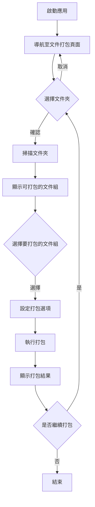
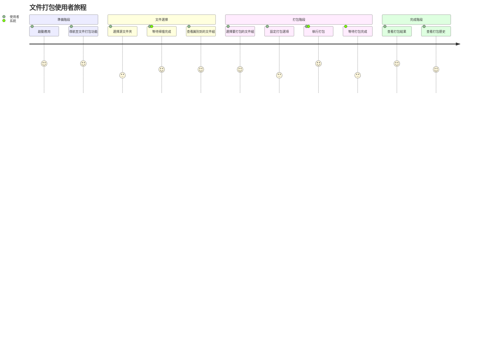
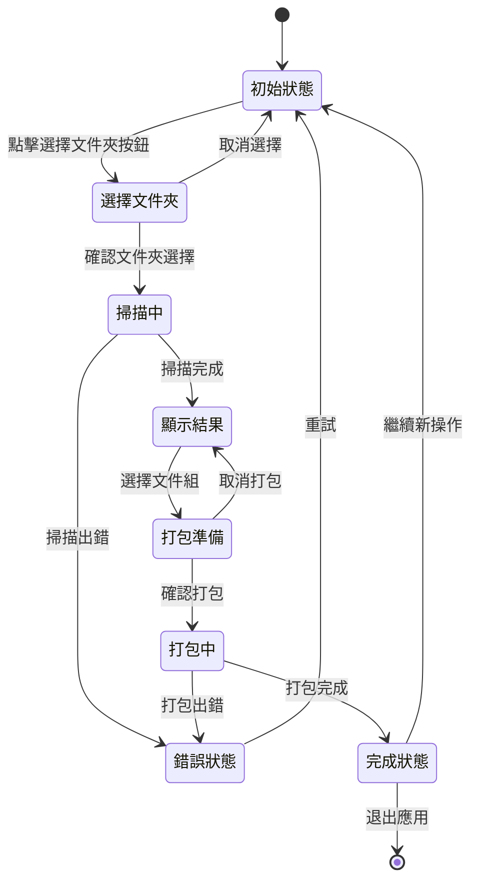
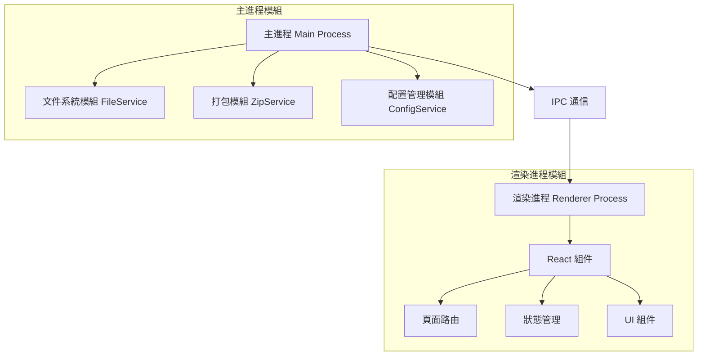
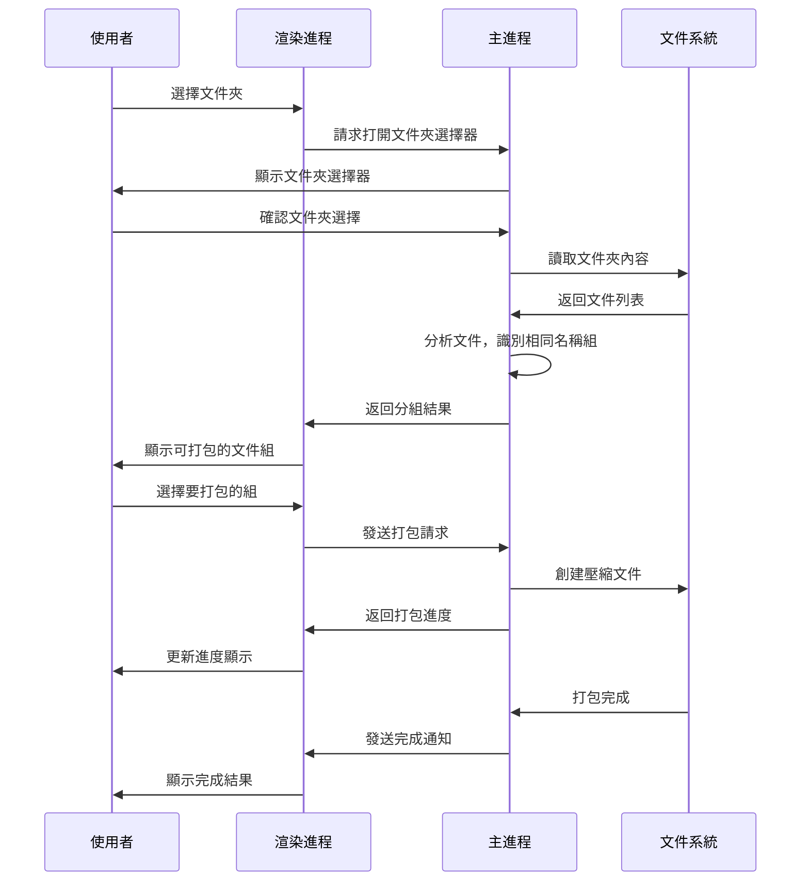

# 文件打包系統產品需求文檔

## 1. 專案概述

### 1.1 背景
使用者在管理數據時，常常會遇到同一個文件有多種不同的格式存在的情況（如同名稱但不同擴展名的文件）。為了更好地組織這些文件，需要一個工具來自動識別並打包這些相關文件，方便使用者管理和分享。

### 1.2 目標
開發一個基於 Electron 的桌面應用，能夠幫助使用者識別文件夾中以相同名稱但不同擴展名存在的文件，並將它們打包成 zip 壓縮文件。同時提供用戶友好的界面，顯示已打包的文件資訊。

### 1.3 使用者群體
- 設計師、開發者等需要管理多種格式資源文件的專業人士
- 需要管理和分享多種格式文件的一般使用者

## 2. 功能需求

### 2.1 核心功能
1. **選擇文件夾**：允許使用者選擇本地文件夾作為掃描和打包的源目錄
2. **識別相同名稱文件**：自動掃描文件夾，找出名稱相同但擴展名不同的文件
3. **文件打包**：將識別到的相同名稱文件打包成 zip 壓縮文件
4. **打包記錄**：顯示已打包的 zip 文件列表及其包含的原始文件
5. **批處理功能**：支持批量選擇和打包多組文件

### 2.2 附加功能
1. **打包設置**：允許自定義打包選項（如壓縮級別、排除特定文件類型等）
2. **預覽功能**：在打包前預覽將被打包的文件
3. **搜尋過濾**：根據文件名或擴展名過濾顯示結果
4. **打包歷史**：記錄和查看過去的打包操作
5. **自動化任務**：設定自動掃描和打包的任務

## 3. 使用者體驗流程

### 3.1 基本流程



### 3.2 使用者旅程圖



### 3.3 狀態流轉圖



## 4. 界面設計

### 4.1 應用布局

應用將採用簡潔、現代的設計風格，包含以下主要區域：

1. **側邊欄**：提供應用功能導航
2. **主要操作區**：顯示文件夾選擇和打包選項
3. **結果顯示區**：展示掃描結果和打包狀態
4. **狀態欄**：顯示應用運行狀態和提示信息

### 4.2 主要頁面設計

#### 文件打包頁面


界面元素：
- 文件夾選擇按鈕和路徑顯示
- 掃描狀態指示器
- 文件組列表（表格顯示）
  - 文件組名稱
  - 包含的文件數量
  - 文件類型標識
  - 操作按鈕（預覽、打包）
- 批量操作按鈕
- 過濾和搜索控件
- 打包進度指示器

#### 打包歷史頁面

界面元素：
- 日期選擇器（篩選歷史記錄）
- 歷史記錄列表
  - 打包時間
  - 源文件夾
  - 打包文件數量
  - 壓縮包路徑
  - 操作按鈕（查看詳情、打開位置）
- 統計信息顯示

### 4.3 交互設計

- **拖放支持**：允許使用者直接拖放文件夾到應用中進行掃描
- **快速預覽**：鼠標懸停在文件組上可顯示包含文件的縮略圖或詳細列表
- **上下文菜單**：右鍵點擊文件組顯示操作選項
- **鍵盤快捷鍵**：支持常用操作的鍵盤快捷方式
- **操作提示**：針對每個操作提供清晰的視覺反饋
- **進度指示**：掃描和打包過程中顯示進度條

## 5. 技術實現方案

### 5.1 架構設計

基於 Electron 的主進程和渲染進程架構：



### 5.2 模組設計

1. **文件系統模組 (FileService)**
   - 文件夾選擇功能
   - 文件掃描與分組
   - 文件操作API封裝

2. **打包模組 (ZipService)**
   - 壓縮算法實現
   - 打包進度追蹤
   - 錯誤處理機制

3. **配置管理模組 (ConfigService)**
   - 用戶設置管理
   - 歷史記錄保存
   - 應用狀態持久化

4. **界面模組**
   - 頁面路由管理
   - 組件狀態管理
   - UI 主題與樣式
   - 響應式設計

### 5.3 數據流設計



### 5.4 IPC 通信設計

需新增的 IPC 通道：

```typescript
// 文件打包相關的 IPC 通道
export enum ZipIPC {
  SCAN_DIRECTORY = 'zip:scan-directory',
  CREATE_ZIP = 'zip:create',
  GET_PACKAGE_HISTORY = 'zip:get-history',
  CLEAR_HISTORY = 'zip:clear-history',
}
```

## 6. 實施計劃

### 6.1 開發階段

1. **基礎架構設計** (3天)
   - 設計應用架構
   - 實現主進程與渲染進程通信

2. **核心功能實現** (5天)
   - 文件掃描與分組邏輯
   - 打包功能實現
   - 基本界面設計

3. **UI 完善** (4天)
   - 完善用戶界面
   - 實現交互邏輯
   - 優化視覺效果

4. **測試與優化** (3天)
   - 功能測試
   - 性能優化
   - 用戶體驗改進

### 6.2 測試計劃

1. **單元測試**：測試關鍵功能模組
2. **集成測試**：測試模組間協作
3. **用戶測試**：邀請目標用戶進行實際使用測試
4. **性能測試**：測試大文件夾和大文件的處理效能

### 6.3 發布策略

1. **內部發布**：提供內部測試版本
2. **Beta發布**：向小部分目標用戶提供測試版
3. **正式發布**：發布正式版本

## 7. 技術實現細節

### 7.1 文件夾掃描算法

```typescript
async function scanDirectory(directoryPath: string): Promise<FileGroup[]> {
  // 1. 讀取目錄中所有文件
  const files = await fs.readdir(directoryPath);
  
  // 2. 按名稱（不含擴展名）進行分組
  const fileGroups = new Map<string, string[]>();
  
  for (const file of files) {
    const filePath = path.join(directoryPath, file);
    const stats = await fs.stat(filePath);
    
    if (stats.isFile()) {
      const ext = path.extname(file);
      const name = path.basename(file, ext);
      
      if (!fileGroups.has(name)) {
        fileGroups.set(name, []);
      }
      
      fileGroups.get(name)!.push(file);
    }
  }
  
  // 3. 過濾只有一個文件的組（沒有相同名稱的多格式文件）
  const result: FileGroup[] = [];
  
  for (const [name, files] of fileGroups.entries()) {
    if (files.length > 1) {
      result.push({
        name,
        files: files.map(file => path.join(directoryPath, file)),
        count: files.length
      });
    }
  }
  
  return result;
}
```

### 7.2 壓縮實現

```typescript
async function createZipPackage(
  filePaths: string[],
  outputPath: string,
  progressCallback: (progress: number) => void
): Promise<boolean> {
  try {
    const archive = archiver('zip', {
      zlib: { level: 9 } // 最高壓縮級別
    });
    
    const output = fs.createWriteStream(outputPath);
    
    return new Promise((resolve, reject) => {
      output.on('close', () => resolve(true));
      archive.on('error', (err) => reject(err));
      
      // 設定進度回調
      let processedBytes = 0;
      const totalBytes = filePaths.reduce(async (sum, filePath) => {
        const stats = await fs.stat(filePath);
        return sum + stats.size;
      }, 0);
      
      archive.on('progress', (progress) => {
        processedBytes = progress.fs.processedBytes;
        progressCallback(processedBytes / totalBytes);
      });
      
      archive.pipe(output);
      
      // 添加文件到壓縮包
      for (const filePath of filePaths) {
        const filename = path.basename(filePath);
        archive.file(filePath, { name: filename });
      }
      
      archive.finalize();
    });
  } catch (error) {
    console.error('Create zip error:', error);
    return false;
  }
}
```

## 8. 附錄

### 8.1 名詞解釋

- **文件組**：指具有相同名稱但不同擴展名的一組文件
- **打包**：將多個文件壓縮成一個 zip 文件的過程
- **批處理**：同時處理多個文件組的操作

### 8.2 可能的擴展功能

- 支持更多壓縮格式 (如 .rar, .7z)
- 雲存儲集成
- 自動同步功能
- 文件預覽增強
- 多語言支持
