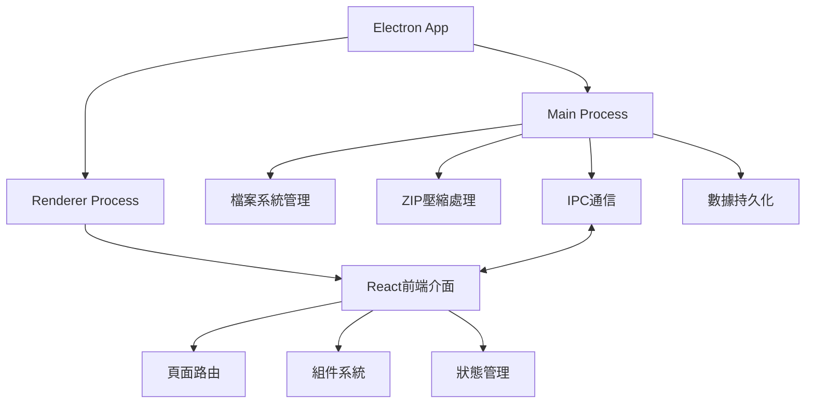

# 文件打包系統技術實現方案概要

## 1. 技術架構概覽

本項目基於 Electron + React + TypeScript 技術棧，採用主進程與渲染進程分離的架構，透過 IPC 通信進行數據交換。



## 2. 核心功能模組

### 2.1 ZIP 服務模組 (主進程)

負責文件掃描、分組與壓縮功能的核心模組。主要功能包括：

- **目錄掃描**：掃描指定目錄，識別具有相同名稱但不同擴展名的文件組
- **文件分組**：將文件按照基本名稱分組，過濾掉單一文件（沒有同名異擴展名的文件）
- **文件壓縮**：將文件組打包成ZIP壓縮包
- **歷史記錄**：維護壓縮操作的歷史記錄

此模組將註冊以下IPC通道：
- `zip:scan-directory` - 掃描目錄
- `zip:create` - 創建ZIP壓縮包
- `zip:get-history` - 獲取壓縮歷史
- `zip:clear-history` - 清除歷史記錄

### 2.2 路由與頁面結構 (渲染進程)

新增的頁面和路由設計：

```typescript
// 新增路由配置
<Routes>
  <Route path="/" element={<Home />} />
  <Route path="/settings" element={<Settings />} />
  <Route path="/csv-validation" element={<CsvValidation />} />
  <Route path="/image-analyze" element={<ImageAnalyze />} />
  <Route path="/file-packaging" element={<FilePackaging />} /> // 新增
  <Route path="/packaging-history" element={<PackagingHistory />} /> // 新增
</Routes>
```

### 2.3 側邊欄菜單擴展

在現有側邊欄菜單中增加文件打包功能入口：

```typescript
// 新增菜單項
const menuItems = [
  // 現有菜單項...
  {
    key: '/file-packaging',
    icon: <FileZipOutlined />,
    label: '文件打包',
  },
  {
    key: '/packaging-history',
    icon: <HistoryOutlined />,
    label: '打包歷史',
  },
  // 其他菜單項...
];
```

## 3. 數據結構設計

### 3.1 文件組數據結構

```typescript
// 文件組類型定義
interface FileGroup {
  name: string;             // 文件基本名稱（不含擴展名）
  files: FileInfo[];        // 文件信息數組
  count: number;            // 文件數量
  basePath: string;         // 源目錄路徑
}

// 文件信息類型定義
interface FileInfo {
  path: string;             // 完整路徑
  name: string;             // 文件名（含擴展名）
  extension: string;        // 擴展名
  size: number;             // 文件大小
}
```

### 3.2 壓縮結果數據結構

```typescript
// 壓縮結果類型定義
interface ZipResult {
  success: boolean;         // 是否成功
  outputPath?: string;      // 輸出路徑
  fileCount?: number;       // 文件數量
  message: string;          // 結果消息
}
```

### 3.3 歷史記錄數據結構

```typescript
// 壓縮歷史記錄類型定義
interface ZipHistory {
  id: string;               // 唯一標識
  date: string;             // 日期時間
  name: string;             // 壓縮包名稱
  outputPath: string;       // 輸出路徑
  fileCount: number;        // 文件數量
  originalFiles: string[];  // 原始文件名列表
  sourceDirectory: string;  // 源目錄
}
```

## 4. 用戶界面設計

### 4.1 文件打包頁面

文件打包頁面將包含以下元素：

- **目錄選擇區**：顯示當前選擇的目錄路徑及選擇按鈕
- **掃描結果區**：以表格形式展示掃描到的文件組
  - 文件組名稱
  - 包含的文件數量
  - 文件類型標識（使用圖標）
  - 操作按鈕（預覽、打包）
- **批量操作區**：提供批量選擇和打包功能
- **狀態顯示區**：顯示當前操作狀態和進度

### 4.2 打包歷史頁面

打包歷史頁面將顯示：

- **歷史記錄表格**：顯示所有打包操作的歷史記錄
  - 操作日期時間
  - 壓縮包名稱
  - 文件數量
  - 源目錄
  - 操作按鈕（打開位置、查看詳情）
- **篩選控件**：按日期、名稱等篩選歷史記錄
- **清除歷史**：清除歷史記錄的功能

## 5. IPC 通信設計

新增 IPC 通道定義：

```typescript
// 文件打包相關的 IPC 通道
export enum ZipIPC {
  SCAN_DIRECTORY = 'zip:scan-directory',    // 掃描目錄
  CREATE_ZIP = 'zip:create',                // 創建ZIP壓縮包
  GET_PACKAGE_HISTORY = 'zip:get-history',  // 獲取壓縮歷史
  CLEAR_HISTORY = 'zip:clear-history',      // 清除歷史記錄
}
```

## 6. 功能實現關鍵點

### 6.1 文件掃描與分組

掃描目錄時，系統將：
1. 讀取目錄下所有文件
2. 解析文件名，提取基本名稱（不含擴展名）
3. 按基本名稱將文件分組
4. 過濾掉只有一個文件的組（沒有同名異擴展名的文件）
5. 返回分組結果給前端顯示

### 6.2 ZIP 壓縮實現

壓縮文件時，系統將：
1. 根據文件組創建對應的 ZIP 文件
2. 使用 Node.js 的 archiver 庫進行壓縮
3. 將同名文件添加到壓縮包中
4. 監控壓縮進度並返回給前端
5. 完成後更新歷史記錄

### 6.3 歷史記錄管理

系統將使用 electron-store 持久化存儲壓縮歷史：
1. 每次壓縮完成後，自動記錄到歷史
2. 提供查詢、篩選歷史的功能
3. 支持按日期範圍、文件名等條件查詢
4. 提供清除歷史的功能

## 7. 錯誤處理機制

系統將實現全面的錯誤處理機制：
1. 目錄不存在或無訪問權限
2. 目錄中沒有符合條件的文件
3. 壓縮過程中出錯
4. 目標路徑無寫入權限
5. 文件正被其他程序占用

每種錯誤都會有明確的錯誤代碼和用戶友好的提示信息。

## 8. 性能優化考慮

對於大目錄和大文件的處理：
1. 使用異步操作避免界面凍結
2. 分批處理大量文件
3. 顯示進度指示器
4. 支持取消長時間運行的操作
5. 對常用路徑進行緩存
